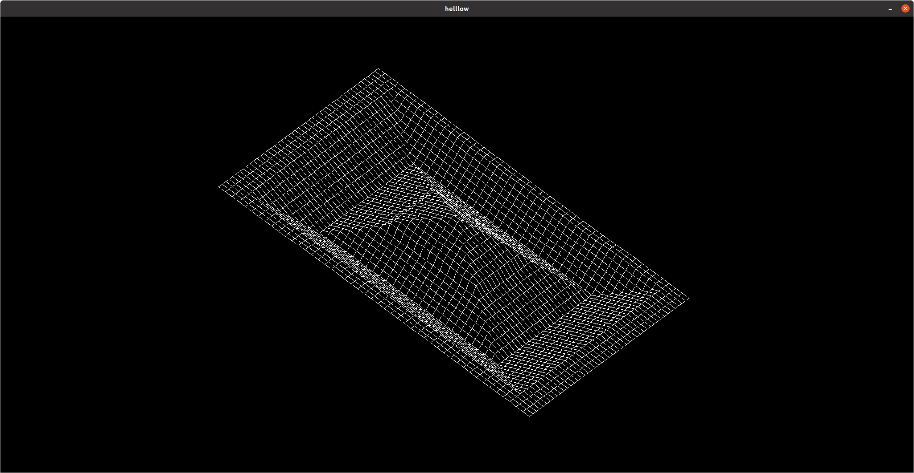
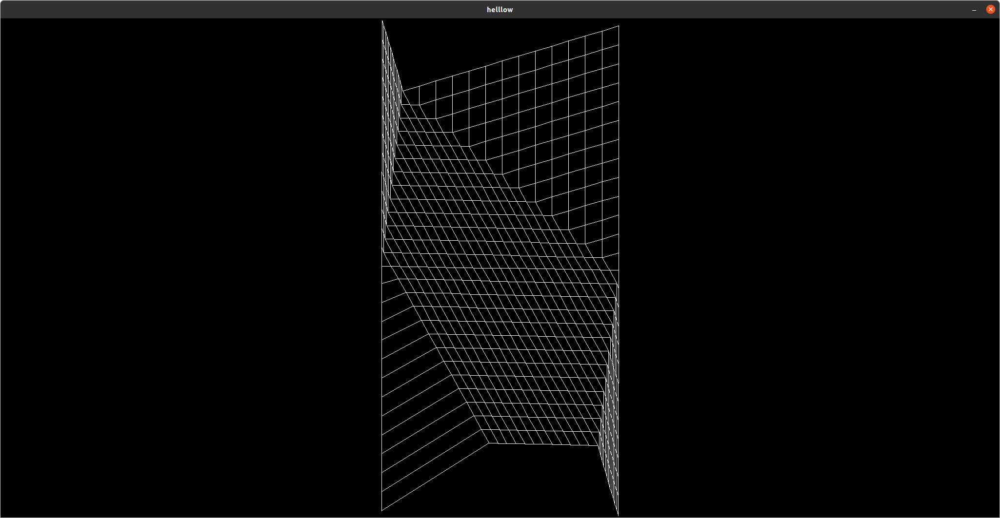

## FDF
>This program generates 3D meshes from a map stored in a text file. The text file is a matrix with numbers where every number rperesents the height of a point the x and y coordinates are the same as the matrix coordinates.
>
> If you want to try it run the following commands
> ```Shell
>    make deps
>    make
>    ./fdf maps/pylone.fdf 
>```
> *This project was developed for linux, suport for other systems is not guaranteed*

## Constorls
* **Move arround:** Arrow keys
* **Rotate:** WASD and QE keys
* **Scale:** shift and ctr, alt and space, z and x

## pylone.fdf

## pyra.fdf

